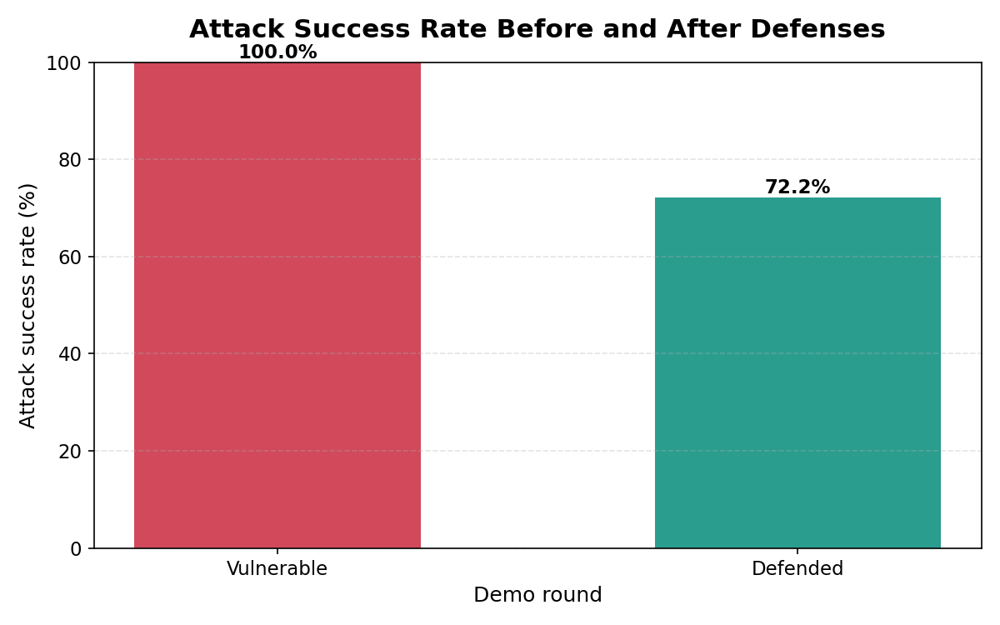
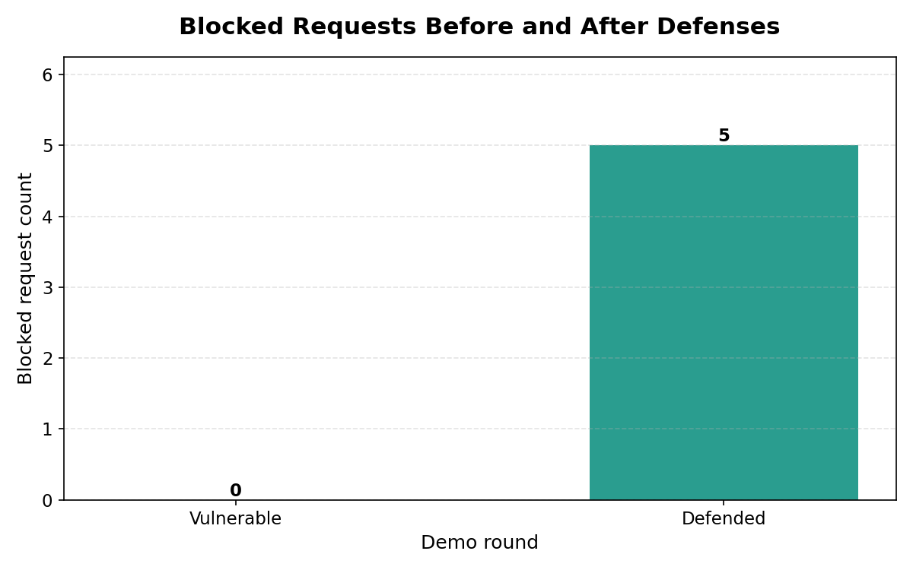
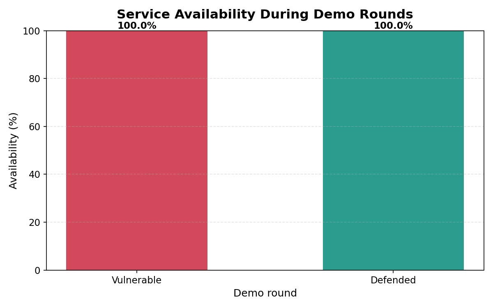
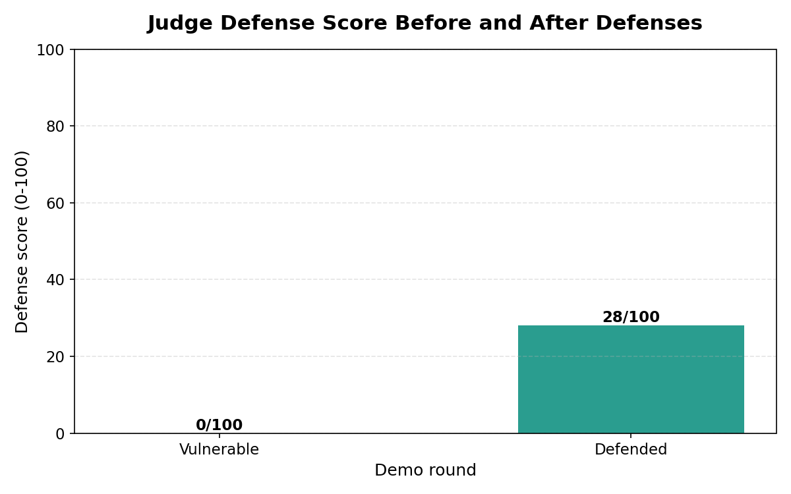

# AI vs AI Local Cybersecurity Demo Report

## Project Overview

This project is a local-only educational cyber range. It models an AI-vs-AI security workflow around a toy communication service. The red agent behaves like a bounded attacker, the blue agent behaves like a defender, and the judge compares what happened before and after defenses were enabled.

## What the Toy Communication Channel Represents

The service is a small FastAPI chat-style API. It has:

- `POST /login` for username/password login.
- `POST /send_message` for sending a message with a token.
- `GET /messages` for reading messages visible to a user.
- `GET /health` for service health and current defense settings.

Technically, the server keeps users, tokens, messages, defense settings, and rate-limit counters in local memory. Security events are written to local JSON-lines logs. The initial service is intentionally weak: it has no rate limiting, no account lockout, weak payload checks, no message size limit, and verbose errors.

## Red Agent Strategy

The red agent only targets the local demo server. It observes `/health`, chooses from a fixed safe set of demo actions, executes bounded requests, and records findings. The safe actions are repeated failed logins, message spam, oversized messages, malformed JSON, and simple endpoint probing.

In the vulnerable round, the red agent is expected to succeed at some actions because the controls are intentionally disabled.

## Blue Agent Strategy

The blue agent reads the local service log and recent red-agent results. It looks for suspicious behavior such as repeated login failures, message floods, malformed requests, endpoint probes, and accepted red-agent actions. In this demo it chose: **Enable standard defenses**.

The enabled defenses were: **rate limit, account lockout, payload validation, safer errors**.

Technically, the defense profile turns on request rate limiting, account lockout after repeated failures, payload validation with a message size cap, and safer error messages.

## Judge Scoring System

The judge scores each round from 0 to 100 based on how many red-agent attempts were blocked. A higher score means the service mitigated more of the bounded local attack attempts. The judge also reports attack success rate, blocked requests, average response time, and service availability.

## Before/After Metrics

| Metric | Vulnerable Round | Defended Round |
|---|---:|---:|
| Attack attempts | 18 | 18 |
| Accepted attempts | 18 | 13 |
| Blocked requests | 0 | 5 |
| Attack success rate | 100.0% | 72.2% |
| Average response time | 1.67 ms | 2.11 ms |
| Service availability | 100.0% | 100.0% |
| Judge defense score | 0/100 | 28/100 |

## Chart Explanations

### Attack Success Before/After

This chart shows the percentage of red-agent attempts that were accepted by the service. A lower defended value means the blue-agent controls reduced attacker success.

### Blocked Requests Before/After

This chart shows how many requests were blocked by defensive controls. In the vulnerable round this is low or zero because the controls start disabled.

### Service Availability Before/After

This chart confirms that the demo service stayed available while defenses were applied. The goal is to mitigate attacks without crashing the service.

### Defense Score Before/After

This chart shows the judge's 0-to-100 defense score. It increases when more red-agent attempts are blocked.

## Limitations and Safety Statement

This is a toy simulation, not a real security testing platform. The attacks are intentionally bounded, local-only, and designed for classroom explanation. The code must never be used against public systems, third-party services, classmates' devices, or any machine you do not own and explicitly control.

The simulation simplifies many real-world details. It uses in-memory state, simple scoring, fixed red-agent strategies, and a single standard blue-agent defense profile. Its purpose is to explain security concepts and defensive reasoning, not to validate production security.
