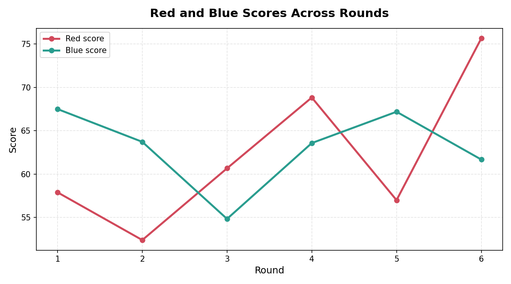
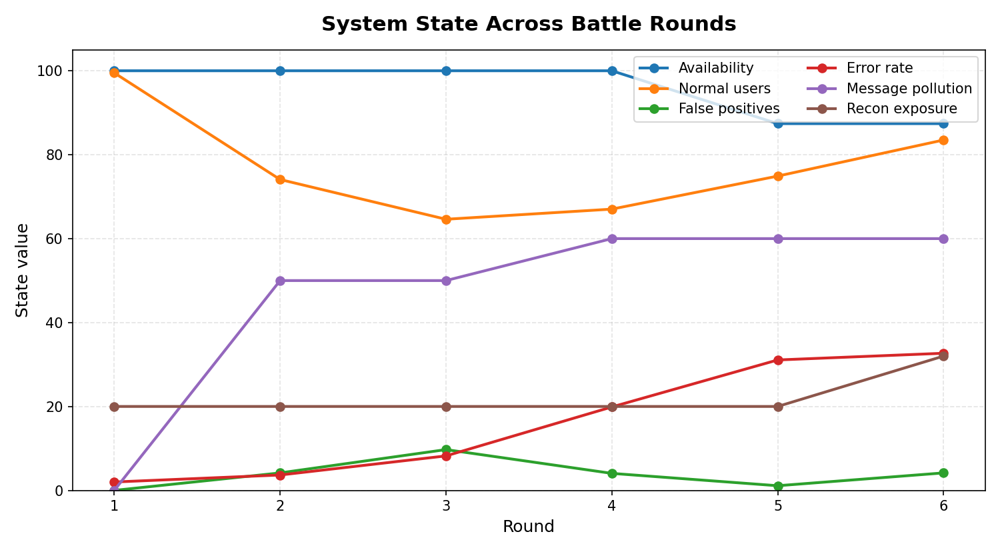

# AI vs AI Multi-Round Cyber Battle Report

## Project Overview

This is a local-only educational cyber range. The arena is a toy FastAPI communication channel: users log in, send messages, read messages, and expose a health endpoint. The battle is not a real penetration test. It is a classroom simulation that shows how attack pressure, defensive tradeoffs, and scoring can evolve over multiple rounds.

## Technical Arena

The toy service has `POST /login`, `POST /send_message`, `GET /messages`, and `GET /health`. It models four users: `alice` and `bob` as regular users, `admin` as an administrator, and `guest` as a low-privilege user. Messages can be public or private, users receive auth tokens after login, and the health endpoint exposes the current message queue size.

The simulation tracks state around that service: service availability, latency, error rate, message queue pollution, message queue size, failed-login pressure, reconnaissance exposure, false positives, false-positive blocks, normal-user latency, and normal-user success. These state variables make attacks matter beyond a simple accepted/blocked counter.

## Normal-User Simulator

During every round, legitimate users attempt to log in, send public/private messages, and read messages. This represents the business goal of the system: normal users should still be able to communicate while blue is defending the service. The judge penalizes blue when defenses cause false-positive blocks, increase normal-user latency, or reduce normal-user success.

## Red Agent Strategy

The red agent runs 6 bounded local rounds. Objectives include reconnaissance, message spam, credential pressure, payload abuse, availability disruption, and low-and-slow probing. Red adapts: if one path is heavily blocked, it shifts toward another objective such as payload abuse or stealthy probing.

## Blue Agent Strategy

The blue agent does not see the judge's ground truth before choosing. It sees only log-style symptoms: volume spikes, failed login pressure, queue pollution, error increases, unknown endpoint activity, and normal-user degradation alerts. Each round it can tune only 1-2 defenses, so it must choose between rate limiting, account lockout, payload validation, and endpoint blocking.

## Defense Tradeoffs

- Rate limiting can reduce spam and availability attacks, but it may slow or block normal-user sends and reads. If usability drops too far, blue can `loosen_rate_limit`.
- Account lockout can reduce credential attacks, but it can lock out valid users after mistakes or pressure. If false positives rise, blue can `loosen_account_lockout`.
- Payload validation blocks oversized messages, but strict validation can reject legitimate long messages.
- Aggressive blocking can reduce reconnaissance, but it has a higher false-positive and defense-cost penalty. Blue can `reduce_aggressive_blocking`.
- Allowlisting normal-user patterns can recover legitimate traffic, but it consumes part of blue's limited action budget.

## Judge Scoring System

The judge has full ground truth after each round. Red receives attack success, disruption, reconnaissance, and stealth points. Blue receives blocked attack, availability, normal-user success, low false-positive, and defense-efficiency points.

The scoring formula is intentionally presentation-friendly: each component is capped, and totals are shown separately for red and blue so the audience can see the tradeoff between stopping attacks and preserving service quality. Normal-user success, normal-user latency, and false-positive blocks are part of the judge's ground truth, but blue only sees symptoms before it chooses defenses.

## Round Timeline

| Round | Battle Phase | Blue Action | Red Score | Blue Score |
|---:|---|---|---:|---:|
| 1 | Round 1: Reconnaissance | add light endpoint blocking | 57.9 | 67.5 |
| 2 | Round 2: Flood Attempt | tune rate limiting | 52.4 | 63.7 |
| 3 | Round 3: Credential Pressure | tune rate limiting, tighten account lockout | 60.7 | 54.8 |
| 4 | Round 4: Payload Abuse | reduce_aggressive_blocking, loosen_rate_limit | 68.8 | 63.6 |
| 5 | Round 5: Availability Disruption | allowlist_normal_user_patterns | 57.0 | 67.2 |
| 6 | Round 6: Low-and-Slow Probing | tune rate limiting, tighten account lockout | 75.7 | 61.7 |

## Final System State

```json
{
  "service_availability": 87.4,
  "average_latency_ms": 115.0,
  "error_rate": 32.68333333333334,
  "message_queue_pollution": 60,
  "message_queue_size": 38,
  "failed_login_pressure": 30.0,
  "reconnaissance_exposure": 32.0,
  "false_positive_rate": 4.166666666666666,
  "false_positive_blocks": 3,
  "normal_user_success_rate": 83.49583333333332,
  "normal_user_latency_ms": 63.25
}
```

## Charts


Shows first-round versus final-round red attack success.


Shows how blue's blocking changed from the opening round to the final round.


Shows whether the service stayed usable while defenses were added.


Shows the judge's blue score at the start and end of the battle.



Shows red and blue score changes across all rounds.



Shows the evolving service state: availability, normal-user success, error rate, message pollution, and reconnaissance exposure.

## Limitations and Safety Statement

This is a toy local simulation. It uses bounded request patterns and a simplified scoring model. It must never target public systems, third-party services, classmates' machines, or any system you do not own and explicitly control. The goal is to explain defensive reasoning and tradeoffs, not to validate production security.
